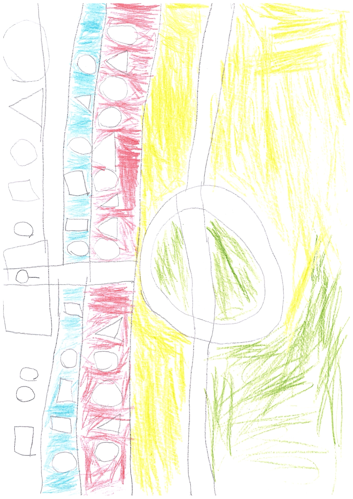

# 🏀 Баскет — 1v1 Half-Court Basketball Game

[](https://opensource.org/licenses/MIT)
[](https://www.ecma-international.org/)
[](https://developer.mozilla.org/en-US/docs/Web/API/Canvas_API)
[](https://developer.mozilla.org/en-US/docs/Web/JavaScript)

Изометрическая баскетбольная игра 1 на 1 для браузера на чистом JavaScript. Полная реализация стритбольных правил с умным AI.

> **🎮 [Играть онлайн](#-запуск)** | **📖 [Документация](#-содержание)** | **🐛 [Сообщить о баге](../../issues)**

---

## 📑 Содержание

- [Особенности](#-особенности)
- [Запуск](#-запуск)
- [Управление](#-управление-клавиатура--мышь)
- [Физика и механика бросков](#️-физика-и-механика-бросков)
- [Архитектура](#-архитектура-и-структура-кода)
- [Настройка параметров](#️-настройка-параметров)
- [Цветовая схема](#-цветовая-схема)
- [Тестирование](#-тестирование)
- [Правила игры](#-правила-игры-1v1-half-court-streetball)
- [Искусственный интеллект](#-искусственный-интеллект)
- [Технологии](#-технологии)
- [Производительность](#-производительность)
- [Roadmap](#-roadmap-и-реализованные-фичи)
- [FAQ](#-faq-часто-задаваемые-вопросы)
- [Отладка](#-отладка-и-разработка)
- [Контрибуция](#-контрибуция)

---

## 🎮 Особенности

- **Изометрическая 2.5D камера** — псевдо-3D вид с корректной сортировкой по глубине
- **Реалистичная физика мяча** — баллистическая траектория, отскоки от щита/обода/пола, эффект Magnus
- **Умный AI с состояниями** — три уровня сложности (Casual/Standard/Competitive)
- **Полная реализация стритбола** — check ball, clear ball, упрощенные фолы, штрафные броски
- **Гибкие настройки** — шот-клок 12/24/∞, системы очков стрит (1/2) или классика (2/3)
- **Современный UI** — glassmorphism, неоновые акценты, командные цвета, индикаторы силы броска
- **Система выносливости** — влияет на скорость и точность, восстанавливается со временем
- **Аудио-система** — Web Audio API, звуковые эффекты, фоновая музыка в меню

## 📸 Скриншоты

<table>
  <tr>
    <td><br/><sup>Оригинальный дизайн-концепт</sup></td>
    <td><i>Игровой процесс<br/>(скриншот будет добавлен)</i></td>
  </tr>
</table>

## 🚀 Запуск

### Требования

- **Браузер**: Chrome 90+, Firefox 88+, Safari 14+, Edge 90+ (ES2020 модули)
- **Node.js**: 18+ (опционально, для dev-инструментов)
- **ОС**: Windows, macOS, Linux

### Быстрый старт

#### Вариант 1: С Node.js (рекомендуется)

```bash
# 1. Клонировать репозиторий
git clone https://github.com/your-username/basket.git
cd basket

# 2. Установить зависимости (для линтинга, форматирования)
npm install

# 3. Запустить dev-сервер с hot-reload
npm run dev

# 4. Открыть в браузере
# → http://localhost:3000
```

#### Вариант 2: Без Node.js

Используйте любой локальный HTTP-сервер:

```bash
# Python 3
python3 -m http.server 3000

# Python 2
python -m SimpleHTTPServer 3000

# PHP
php -S localhost:3000

# Затем откройте http://localhost:3000
```

#### Вариант 3: Прямое открытие (не рекомендуется)

> ⚠️ **Внимание**: ES модули не работают с `file://` протоколом. Используйте HTTP-сервер.

### Первый запуск

1. **Разблокировка аудио**: кликните в любом месте экрана после загрузки
2. **Настройки**: Menu → Настройки → выберите сложность и параметры
3. **Начать игру**: Menu → Играть
4. **Управление**: см. раздел [Управление](#-управление-клавиатура--мышь)

### Для разработчиков

```bash
# Проверка кода
npm run lint

# Автоформатирование
npm run format

# Проверка типов через JSDoc
npm run typecheck

# Все проверки сразу
npm run lint && npm run format && npm run typecheck
```

## 🎯 Управление (Клавиатура + Мышь)

| Клавиша | Действие |
|---------|----------|
| **WASD** или **Стрелки** | Движение игрока |
| **Shift** | Спринт (расходует выносливость, ×2.0 к скорости) |
| **ЛКМ (удерживать)** | Зарядка броска — курсор задает направление, длительность удержания — силу |
| **ЛКМ (отпустить)** | Выполнить бросок |
| **ПКМ** | **В атаке**: step-back (быстрый откат + короткая неуязвимость) или layup под кольцом<br>**В защите**: попытка перехвата/steal (кулдаун 0.7с, риск фола) |
| **Esc** | Пауза |

### Контекстное управление
- **С мячом**: дриблинг происходит автоматически при движении
- **Бросок**: индикатор оптимальной силы показывает нужную мощность в зависимости от дистанции
- **Выносливость**: влияет на скорость движения и точность броска при низком уровне (<30)

## ⚙️ Физика и механика бросков

### Баллистическая траектория

Мяч следует реалистичной физике снаряда:

```javascript
// Уравнения движения
x(t) = x₀ + vₓ × t
y(t) = y₀ + vᵧ × t
z(t) = z₀ + vᵤ × t - ½ × g × t²

// где g = 9.81 м/с² (гравитация)
```

### Формула оптимальной силы броска

```javascript
optimalSpeed = SHOT_BASE_SPEED + distance × SHOT_DISTANCE_FACTOR
            = 6.0 + distance × 0.5

// Пример: для броска с 6 метров
// optimalSpeed = 6.0 + 6 × 0.5 = 9.0 м/с
```

### Магнитное окно (аркадность)

Для баланса между реализмом и доступностью:

- **MAGNETIC_WINDOW = 0.08м** — допуск попадания в обод
- **OPTIMAL_POWER_TOLERANCE = ±8%** — допуск силы броска
- Мяч "притягивается" к ободу при правильной силе и траектории

### Коллизии и отскоки

1. **Щит (backboard)**: AABB коллизия, сохранение энергии с `BOUNCE_FACTOR = 0.75`
2. **Обод (rim)**: круговая коллизия (radius = 0.23м), зависит от угла входа
3. **Пол (floor)**: отскок при `z < BALL_RADIUS`, трение `FRICTION_GROUND = 0.95`
4. **Сетка (net)**: визуальный эффект при прохождении (swish)

## 📐 Архитектура и структура кода

### Дерево проекта

```
basket/
├── index.html              # Главная страница, Canvas, UI overlay
├── jsconfig.json           # TypeScript конфигурация для JSDoc
├── package.json            # NPM зависимости и скрипты
├── favicon.ico             # Иконка сайта
│
├── styles/                 # CSS стили (glassmorphism)
│   ├── base.css           # Ресеты, переменные, базовые стили
│   ├── ui.css             # UI компоненты (меню, кнопки, HUD)
│   └── animations.css     # CSS keyframes анимации
│
├── src/
│   ├── main.js            # Точка входа, инициализация игры
│   ├── config.js          # Все параметры игры (CONFIG, GameSettings)
│   │
│   ├── core/              # Ядро игры (универсальные системы)
│   │   ├── Game.js        # Главный класс игры, владелец всех систем
│   │   ├── Loop.js        # Fixed timestep игровой цикл с интерполяцией
│   │   ├── SceneManager.js # Управление сценами и переходами
│   │   ├── InputManager.js # Обработка клавиатуры/мыши/pointer events
│   │   ├── AudioManager.js # Web Audio API, разблокировка, SFX
│   │   ├── Math.js        # Математические утилиты (векторы, interpolation)
│   │   └── Projection.js  # Изометрическая проекция (worldToScreen/screenToWorld)
│   │
│   ├── scenes/            # Игровые сцены (State Pattern)
│   │   ├── BootScene.js   # Инициализация систем
│   │   ├── PreloadScene.js # Загрузка ассетов с прогресс-баром
│   │   ├── MenuScene.js   # Главное меню (Играть, Настройки, Управление)
│   │   ├── GameScene.js   # Основная игровая сцена
│   │   ├── PauseScene.js  # Пауза (Esc)
│   │   └── GameOverScene.js # Экран победы/поражения
│   │
│   └── game/              # Игровая логика (баскетбольные механики)
│       ├── Player.js      # Игрок с выносливостью, состояниями, анимацией
│       ├── Ball.js        # Мяч с баллистикой, отскоками, коллизиями
│       ├── AIController.js # AI State Machine (9 состояний)
│       ├── Physics.js     # AABB/круг коллизии, разрешение пересечений
│       ├── CourtRenderer.js # Отрисовка корта, трибун, разметки
│       ├── Rules.js       # Правила стритбола, счет, фолы
│       └── HUD.js         # Интерфейс (счет, шот-клок, индикаторы)
│
├── assets/                # Ассеты игры
│   ├── audio/             # WAV звуковые эффекты
│   └── README.md          # Описание ассетов
│
├── design/                # Дизайн-референсы
│   └── design1.png        # Оригинальный концепт-арт
│
└── docs/                  # Документация (тесты, багфиксы)
    ├── TEST_REPORT.md     # Базовые тесты
    ├── TESTING_*.md       # Инструкции и результаты тестирования
    ├── BROWSER_*_TEST_REPORT.md  # Кросс-браузерное тестирование
    ├── BUGFIX_*.md        # История исправлений багов
    ├── FIXES_*.md         # Списки примененных фиксов
    └── CENTERING_FIX_REPORT.md
```

### Архитектурные паттерны

#### 1. **Game Loop** (Fixed Timestep + Interpolation)
```javascript
// src/core/Loop.js
const FIXED_DT = 1/60;
accumulator += deltaTime;

while (accumulator >= FIXED_DT) {
    scene.update(FIXED_DT);  // Детерминированная логика
    accumulator -= FIXED_DT;
}

const alpha = accumulator / FIXED_DT;
scene.render(ctx, alpha);  // Интерполированный рендер
```

#### 2. **Scene Manager** (State Pattern)
```javascript
// Каждая сцена имеет:
class Scene {
    enter(payload) {}     // Инициализация при входе
    exit() {}             // Очистка при выходе
    update(dt) {}         // Логика (fixed timestep)
    render(ctx, alpha) {} // Рендер (интерполированный)
    handleInput(event) {} // Обработка ввода
}
```

#### 3. **Entity-Component** (упрощенный)
```javascript
// Player/Ball — самодостаточные сущности с:
// - Состоянием (pos, vel, state)
// - Логикой (update)
// - Рендером (render)
```

#### 4. **AI State Machine**
```javascript
// src/game/AIController.js
states = {
    defend_press: { enter, update, exit },
    attack_drive: { enter, update, exit },
    // ... 9 состояний
}
```

### Ключевые системы

#### Изометрическая проекция

```javascript
// src/core/Projection.js
export function worldToScreen(worldX, worldY, worldZ) {
    const screenX = (worldX - worldY) * tileWidth / 2;
    const screenY = (worldX + worldY) * tileHeight / 2 - worldZ;
    return { x: screenX, y: screenY };
}
```

#### Физика мяча

```javascript
// src/game/Ball.js
update(dt) {
    this.vel.z -= GRAVITY * dt;  // Гравитация
    this.pos.x += this.vel.x * dt;
    this.pos.y += this.vel.y * dt;
    this.pos.z += this.vel.z * dt;
    
    // Коллизии: обод, щит, пол
    this.checkRimCollision();
    this.checkBackboardCollision();
    this.checkFloorCollision();
}
```

#### Управление входом

```javascript
// src/core/InputManager.js
// Pointer events для K+M
// Маппинг действий:
// - movement: WASD/стрелки
// - sprint: Shift
// - shoot: ЛКМ (hold/release)
// - contextAction: ПКМ (steal/stepback)
// - pause: Escape
```

## ⚙️ Настройка параметров

Все параметры игры находятся в `src/config.js`:

### Основные игровые параметры

```javascript
GAME: {
    WIN_SCORE: 11,                    // Очки для победы
    SHOT_CLOCK_DEFAULT: 24,           // Шот-клок по умолчанию (секунды)
    SHOT_CLOCK_WARNING: 5,            // Предупреждение при оставшихся секундах
    
    // Системы очков
    SCORING_STREET: { INSIDE: 1, THREE_POINT: 2 },   // Стритбол (по умолчанию)
    SCORING_CLASSIC: { INSIDE: 2, THREE_POINT: 3 },  // Классический баскетбол
    
    // Механики
    STEAL_COOLDOWN: 0.7,              // Кулдаун перехвата
    STEPBACK_COOLDOWN: 0.5,           // Кулдаун step-back
    FOUL_PROBABILITY: 0.35,           // Вероятность фола при контакте
}
```

### Параметры игрока

```javascript
PLAYER: {
    BASE_SPEED: 3.6,                  // Базовая скорость (м/с)
    SPRINT_MULTIPLIER: 2.0,           // Множитель спринта
    ACCELERATION: 15.0,               // Ускорение
    FRICTION: 12.0,                   // Трение
    
    STAMINA_MAX: 100,                 // Максимальная выносливость
    STAMINA_SPRINT_DRAIN: 12,         // Расход при спринте (в секунду)
    STAMINA_REGEN: 12,                // Восстановление (в секунду)
    
    RADIUS: 0.35,                     // Радиус коллизии (метры)
    HEIGHT: 1.85,                     // Рост (метры)
}
```

### Физика мяча

```javascript
BALL: {
    RADIUS: 0.12,                     // Радиус мяча (метры)
    GRAVITY: 9.81,                    // Гравитация (м/с²)
    BOUNCE_FACTOR: 0.75,              // Коэффициент отскока
    
    // Параметры броска
    MAGNETIC_WINDOW: 0.08,            // "Магнитное" окно попаданий (метры)
    OPTIMAL_POWER_TOLERANCE: 0.08,    // Допуск оптимальной силы (±8%)
    SHOT_BASE_SPEED: 6.0,             // Базовая скорость броска
    SHOT_DISTANCE_FACTOR: 0.5,        // Формула: speed = base + distance × factor
    
    POWER_CHARGE_RATE: 1.2,           // Скорость зарядки броска
}
```

### Размеры корта (реальные FIBA)

```javascript
COURT: {
    WIDTH: 15,                        // Ширина (метры)
    LENGTH: 14,                       // Длина половины корта
    THREE_POINT_RADIUS: 6.75,         // Радиус трехочковой дуги
    FREE_THROW_DISTANCE: 4.6,         // Расстояние штрафной линии
    RIM_RADIUS: 0.23,                 // Радиус обода
    RIM_HEIGHT: 3.05,                 // Высота обода
    BACKBOARD_WIDTH: 1.8,             // Ширина щита
    BACKBOARD_HEIGHT: 1.05,           // Высота щита
}
```

### Уровни сложности AI

```javascript
AI: {
    DIFFICULTIES: {
        CASUAL: {
            REACTION_TIME: 0.5,
            SHOT_ACCURACY: 0.6,
            DEFENSE_DISTANCE: 1.5,
            STEAL_CHANCE: 0.15,
        },
        STANDARD: {                   // По умолчанию
            REACTION_TIME: 0.3,
            SHOT_ACCURACY: 0.75,
            DEFENSE_DISTANCE: 1.2,
            STEAL_CHANCE: 0.25,
        },
        COMPETITIVE: {
            REACTION_TIME: 0.15,
            SHOT_ACCURACY: 0.85,
            DEFENSE_DISTANCE: 0.9,
            STEAL_CHANCE: 0.35,
        },
    }
}
```

### Изометрическая проекция

```javascript
ISO: {
    TILE_WIDTH: 64,                   // Ширина изометрической плитки (пиксели)
    TILE_HEIGHT: 32,                  // Высота плитки
    SCALE: 1.0,                       // Общий масштаб
}

// Формулы проекции (в Projection.js):
// screenX = (worldX - worldY) × TILE_WIDTH / 2
// screenY = (worldX + worldY) × TILE_HEIGHT / 2 - worldZ
```

## 🎨 Цветовая схема

Основана на дизайне из `design/design1.png` с реалистичным паркетом:

```javascript
COLORS: {
    COURT_YELLOW: '#C87533',      // Стандартный баскетбольный паркет (коричнево-оранжевый)
    TRIBUNE_RED: '#FF4D5A',       // Трибуна команды AI (красные)
    TRIBUNE_BLUE: '#39B8FF',      // Трибуна команды игрока (голубые)
    LINE_WHITE: '#FFFFFF',        // Белая разметка корта с легким свечением
    ACCENT_NEON: '#7CFFEA',       // Неоновые акценты (cyan)
    
    RIM_ORANGE: '#FF6600',        // Обод кольца
    BOARD_GLASS: 'rgba(255, 255, 255, 0.15)', // Стеклянный щит
    NET_WHITE: 'rgba(255, 255, 255, 0.7)',    // Сетка
    
    TEAM_PLAYER: '#39B8FF',       // Цвет команды игрока
    TEAM_AI: '#FF4D5A',           // Цвет команды AI
}
```

### Визуальные элементы

- **Корт**: Реалистичный паркет с текстурным шумом, официальная разметка половины корта FIBA
- **Трибуны**: Два яруса по бокам (красная и голубая секции) с неоновыми лентами
- **Борта**: Геометрические пиктограммы (круг/треугольник/квадрат) с чередованием
- **Кольцо**: Оранжевый обод, стеклянный щит с неоновой каймой, полупрозрачная сетка
- **UI**: Glassmorphism стиль, мягкие тени, полупрозрачные панели
- **HUD**: Счет слева/справа, шот-клок сверху по центру, индикаторы выносливости и силы броска

## 🧪 Тестирование

### Скрипты проверки

```bash
# Линтинг
npm run lint

# Форматирование
npm run format

# Проверка типов (JSDoc)
npm run typecheck
```

### Тестовые отчеты и документация

В проекте доступна подробная документация по тестированию и исправлениям в папке `docs/`:

- **[`TEST_REPORT.md`](docs/TEST_REPORT.md)** — базовые тесты геймплея
- **[`TESTING_RESULTS.md`](docs/TESTING_RESULTS.md)** — результаты тестирования механик
- **[`TESTING_SUMMARY.md`](docs/TESTING_SUMMARY.md)** — сводка по всем тестам
- **[`BROWSER_TEST_REPORT.md`](docs/BROWSER_TEST_REPORT.md)** — кросс-браузерное тестирование
- **[`TESTING_INSTRUCTIONS.md`](docs/TESTING_INSTRUCTIONS.md)** — инструкции по тестированию

### История исправлений

- **[`BUGFIX_OUT_OF_BOUNDS.md`](docs/BUGFIX_OUT_OF_BOUNDS.md)** — фикс выхода игроков за границы корта
- **[`BUGFIX_SHOT_CLOCK_AND_BALL_PICKUP.md`](docs/BUGFIX_SHOT_CLOCK_AND_BALL_PICKUP.md)** — исправление шот-клока и подбора мяча
- **[`BUGFIX_REPORT.md`](docs/BUGFIX_REPORT.md)** — основной отчет по багфиксам
- **[`BUGFIX_REPORT_2.md`](docs/BUGFIX_REPORT_2.md)** — дополнительные исправления
- **[`CENTERING_FIX_REPORT.md`](docs/CENTERING_FIX_REPORT.md)** — исправление центрирования камеры
- **[`FIXES_APPLIED.md`](docs/FIXES_APPLIED.md)** — список примененных фиксов
- **[`FIXES_COMPLETED.md`](docs/FIXES_COMPLETED.md)** — завершенные исправления

### Автоматизированное тестирование

```bash
# Открыть тестовую страницу в браузере
open autotest.html

# Или альтернативная
open test-game.html
```

## 📝 Правила игры (1v1 Half-Court Streetball)

### Основные правила

1. **Победа**: Первый игрок, набравший **11 очков**, побеждает
2. **Система очков** (по умолчанию — стритбол):
   - **Стрит (1/2)**: 1 очко внутри дуги, 2 очка из-за трехочковой
   - **Классика (2/3)**: 2 очка внутри, 3 очка из-за дуги (опция в настройках)
3. **Шот-клок**: 24 секунды на атаку (настраивается: 12/24/∞)
   - Предупреждающий сигнал за 5 секунд до окончания
   - Нарушение шот-клока — смена владения

### Стритбольные механики

4. **Check ball** (проверка мяча):
   - После каждого попадания в корзину
   - Мяч возвращается на верх штрафной зоны
   - Оба игрока готовятся к новому розыгрышу
   
5. **Clear ball** (очистка мяча):
   - После подбора в защите/перехвата
   - Мяч нужно вывести за трехочковую линию
   - Только потом можно атаковать кольцо
   - Зона "очистки" визуально подсвечена

### Фолы и штрафные

6. **Упрощенные фолы**:
   - При агрессивном контакте/отборе (вероятность 35%)
   - При контакте по руке во время броска
   - **Наказание**: 1 штрафной бросок = 1 очко
   - После штрафного — check ball у штрафной линии

### Игровые состояния

7. **Владение мячом**:
   - Дриблинг автоматический при движении с мячом
   - Step-back для создания пространства (кулдаун 0.5с, 0.15с неуязвимости)
   - Layup доступен при близком расположении к кольцу
   
8. **Защита**:
   - Перехват/steal доступен по ПКМ (кулдаун 0.7с)
   - Риск фола при неудачной попытке перехвата
   - Контест снижает точность броска противника

### Выносливость

9. **Система стамины**:
   - Максимум 100 единиц
   - Спринт расходует 12 ед/с
   - Восстановление 12 ед/с в покое
   - При низком уровне (<30): снижение скорости на 20%, точности на 15%

## 🤖 Искусственный интеллект

AI построен на системе состояний (State Machine) с контекстным поведением:

### Состояния AI

- **defend_press** — активный прессинг с мячом
- **defend_contest** — контест броска
- **recover** — возвращение в защитную позицию
- **attack_drive** — проход к кольцу
- **attack_probe** — оценка ситуации в атаке
- **shoot** — выполнение броска
- **rebound** — борьба за подбор
- **check_ball** — позиционирование на check ball
- **clear_ball** — очистка мяча за дугу

### Особенности поведения

- **Тайм-менеджмент**: следит за шот-клоком, форсирует бросок при <5 секундах
- **Адаптивность**: учитывает дистанцию, усталость, контест игрока
- **Стохастика**: добавляет вариативность в решения для естественности
- **Зональная защита**: перекрывает проход к кольцу, держит дистанцию
- **Оценка ситуации**: анализирует открытость для броска vs проход

## 🔧 Технологии

- **Vanilla JavaScript ES2020+** — без фреймворков, чистые модули
- **HTML5 Canvas 2D** — отрисовка игры с учетом DPR
- **Web Audio API** — звуковые эффекты (decodeAudioData, AudioBufferSourceNode)
- **CSS3** — градиенты, анимации, glassmorphism эффекты
- **ES Modules** — нативная модульность (import/export)
- **JSDoc + TypeScript** — статическая типизация без компиляции (//@ts-check)
- **LocalStorage** — сохранение настроек и прогресса

## 📊 Производительность

- **Целевой FPS**: 60 (стабильно на средних ПК)
- **Fixed timestep**: 1/60 секунды с интерполяцией рендера (alpha blending)
- **Игровой цикл**: Аккумулятор времени с ограничением (max 1/15), защита от спирали смерти
- **Оптимизации**: 
  - Offscreen canvas для статических элементов (трибуны, борта)
  - Кэширование часто используемых расчетов
  - Минимизация аллокаций в update/render циклах
- **DPR Support**: Корректное масштабирование под Retina/HiDPI дисплеи
- **Размер**: ~150-200 KB gzip (без ассетов)

## 🎯 Roadmap и реализованные фичи

### ✅ Реализовано

- [x] Изометрическая 2.5D проекция с корректной сортировкой
- [x] Полная физика мяча (баллистика, отскоки, коллизии)
- [x] AI с состояниями (3 уровня сложности)
- [x] Стритбольные правила (check ball, clear ball, фолы)
- [x] Система выносливости с влиянием на геймплей
- [x] HUD с индикаторами (счет, шот-клок, выносливость, сила броска)
- [x] Управление K+M с контекстным ПКМ
- [x] Настройки (сложность, шот-клок, система очков, громкость)
- [x] Сцены (Boot, Preload, Menu, Game, Pause, GameOver)
- [x] Звуковые эффекты через Web Audio API
- [x] Сохранение настроек в localStorage
- [x] Адаптация под DPR и ресайз окна
- [x] Детальная визуализация корта с реальными размерами FIBA

### 🔜 В планах

- [ ] Улучшенные анимации игроков (skeleton animation с IK)
- [ ] Эффекты частиц (пот, пыль от паркета, искры при броске)
- [ ] Локальная таблица рекордов с метриками
- [ ] Расширенная статистика матча
- [ ] Replay system (запись и воспроизведение лучших моментов)
- [ ] Больше архетипов игроков (Shooter, Defender, Athletic)
- [ ] Турнирный режим
- [ ] Customization (выбор формы, цветов, аксессуаров)
- [ ] Мультиплеер (WebRTC peer-to-peer)
- [ ] Mobile support (touch controls)

## 📄 Лицензия

MIT

## ❓ FAQ (Часто задаваемые вопросы)

### Игровые механики

**Q: Почему мяч не попадает в кольцо?**  
A: Проверьте индикатор силы броска. Оптимальная сила зависит от дистанции. Зеленая зона индикатора показывает нужную мощность. Также на точность влияет выносливость (<30 = -15% точности).

**Q: Как работает "очистка мяча" (clear ball)?**  
A: После перехвата или подбора в защите нужно вывести мяч за трехочковую линию (подсвечена зеленым). Только после этого можно атаковать кольцо.

**Q: Что такое check ball?**  
A: После каждого попадания оба игрока возвращаются к штрафной линии для начала нового розыгрыша. Это стандартное правило стритбола.

**Q: Как сделать steal (перехват)?**  
A: Нажмите ПКМ в защите рядом с противником. Учтите кулдаун 0.7с и риск фола (35% при неудаче).

**Q: Зачем нужен step-back?**  
A: ПКМ в атаке делает быстрый откат назад с 0.15с неуязвимости. Используйте для создания пространства перед броском.

### Настройки

**Q: Как изменить сложность AI?**  
A: Меню → Настройки → Сложность (Casual/Standard/Competitive). Влияет на точность, скорость реакции и агрессивность AI.

**Q: Можно ли отключить шот-клок?**  
A: Да, в настройках выберите "Без ограничений" (∞). Также доступны варианты 12 и 24 секунды.

**Q: В чем разница между системами очков?**  
A: **Стрит (1/2)**: быстрые игры, акцент на дальние броски. **Классика (2/3)**: традиционный баскетбол.

### Технические вопросы

**Q: Игра тормозит на моем ПК**  
A: Убедитесь, что у вас современный браузер (Chrome/Firefox/Edge) и включено аппаратное ускорение. Игра оптимизирована для 60 FPS на средних ПК.

**Q: Звук не работает**  
A: Web Audio API требует взаимодействия пользователя для разблокировки. Кликните в любом месте экрана после загрузки. Также проверьте регулятор громкости в настройках.

**Q: Как сбросить настройки?**  
A: Откройте консоль браузера (F12) и выполните: `localStorage.removeItem('basket_game')`

**Q: Сохраняется ли прогресс?**  
A: Настройки сохраняются автоматически в localStorage браузера. Результаты матчей пока не сохраняются (в планах).

## 🧪 Отладка и разработка

### Debug режим

В `src/config.js` можно включить отладочные опции:

```javascript
DEBUG: {
    SHOW_FPS: true,              // Показать FPS счетчик
    SHOW_COLLIDERS: true,        // Визуализация коллайдеров
    SHOW_AI_STATE: true,         // Текущее состояние AI
    SHOW_COORDINATES: true,      // Координаты игроков
}
```

### Dev Tools скрипты

```bash
# Запуск с hot-reload (требует serve)
npm run dev

# Проверка кода
npm run lint

# Форматирование
npm run format

# Проверка типов через JSDoc
npm run typecheck
```

## 🤝 Контрибуция

Pull requests приветствуются! Для больших изменений откройте issue для обсуждения.

### Guidelines

1. Следуйте существующему стилю кода (ESLint + Prettier)
2. Добавляйте JSDoc комментарии для новых функций
3. Тестируйте на 60 FPS
4. Сохраняйте совместимость с современными браузерами

## 📞 Поддержка

Нашли баг или хотите предложить фичу?  
Откройте [Issue](../../issues) в GitHub репозитории.

---

**Приятной игры! 🏀**


